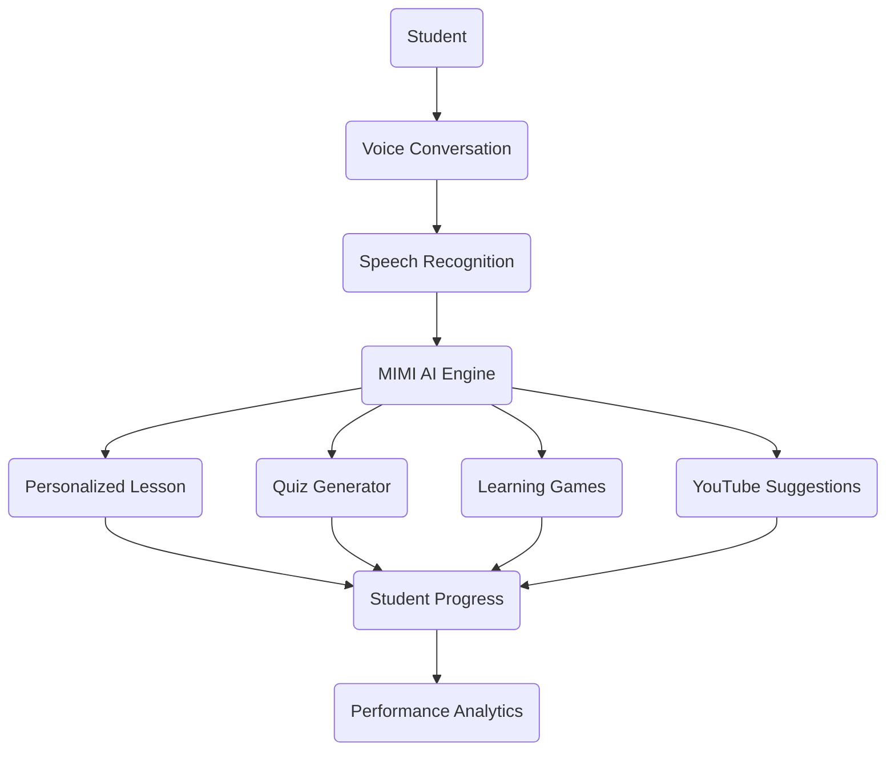

<div align="center">

# MIMI – AI Voice Learning Tutor

### Your Intelligent AI Learning Companion


<br>

<p>
  
  
  
  
</p>

### Learn • Speak • Understand • Grow

An AI-powered voice tutor that delivers personalized learning through natural conversations, interactive quizzes, educational videos, AI-generated study plans, and intelligent progress tracking.

**Portfolio:** https://innovativeais.com/others/portfolio-mimy.php

</div>

---

# About MIMI

MIMI is an intelligent AI voice tutor developed under the **ALEXI AI** ecosystem to make education more interactive and personalized.

Students can communicate naturally with MIMI using voice, ask questions, receive detailed explanations, solve quizzes, watch recommended educational videos, play learning games, and monitor their academic progress—all from a single platform.

The goal of MIMI is to make learning engaging, adaptive, and accessible for learners of every age.

---

# Key Features

| Feature | Description |
|---------|-------------|
| AI Voice Tutor | Natural human-like conversations |
| Personalized Lessons | Adaptive learning based on student level |
| Quiz Generator | Dynamic quizzes after every lesson |
| Learning Games | Interactive educational activities |
| YouTube Recommendations | Curated educational videos |
| Progress Analytics | Student performance tracking |
| Study Planner | AI-generated study schedules |
| Multi-language Support | Learn in multiple languages |

---

# Learning Workflow



---

# Supported Subjects

- Mathematics
- Physics
- Chemistry
- Biology
- English
- Computer Science
- Programming
- Artificial Intelligence
- Machine Learning
- Data Science
- History
- Geography
- General Knowledge
- Competitive Exams

---

# Student Dashboard

```text
---------------------------------------------

Lessons Completed      ████████████ 88%

Quiz Accuracy          ██████████   93%

Learning Games         █████████    82%

Learning Streak        24 Days

Study Time             51 Hours

Performance            Excellent

---------------------------------------------
```

---

# Core Modules

- Student Profile
- AI Voice Assistant
- Smart Learning
- Quiz Generator
- Learning Games
- Progress Dashboard
- Study Planner
- Video Recommendation
- Notifications

---

# Technology Stack

| Frontend | Backend | AI | Database |
|-----------|----------|----|----------|
| HTML5 | Python | OpenAI / Gemini | SQLite / MySQL |
| CSS3 | Django | Speech-to-Text | PostgreSQL |
| JavaScript | FastAPI | Text-to-Speech | Firebase |
| Bootstrap | REST APIs | LLM | |

---

# Project Structure

```text
MIMI/
│
├── README.md
├── assets/
│   ├── images/
│   ├── audio/
│   └── models/
├── backend/
├── frontend/
├── api/
├── static/
├── templates/
├── requirements.txt
└── manage.py
```

---

# Security

- Secure Authentication
- Encrypted User Data
- Session Management
- API Security
- Input Validation
- Role-Based Access
- Secure File Upload

---

# Why MIMI?

- Personalized Learning
- AI Voice Conversations
- Interactive Quizzes
- Adaptive Study Plans
- Educational Games
- Smart Recommendations
- Progress Tracking
- Modern Learning Experience

---

# Future Enhancements

- Android & iOS Application
- AI Face Emotion Detection
- Regional Language Support
- Live Teacher Assistance
- AR / VR Learning
- Memory-based Revision
- Gamification & Rewards
- AI Homework Assistant

---

# Screenshots

Create a folder named **screenshots** and add images like:

```text
screenshots/
├── dashboard.png
├── voice-chat.png
├── quiz.png
├── progress.png
└── study-plan.png
```

---

# Contributing

Contributions are welcome.

1. Fork this repository.
2. Create a feature branch.
3. Commit your changes.
4. Push your branch.
5. Open a Pull Request.

---

# License

This project is licensed under the MIT License.

---

<div align="center">

## Built for the Future of AI-Powered Education

### ALEXI AI

Empowering learners through intelligent voice-based education.

If you found this project helpful, consider giving it a star.

</div>
