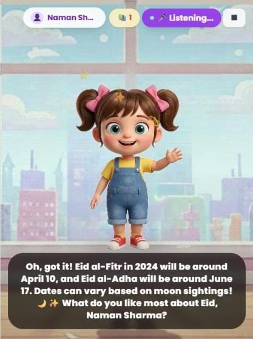
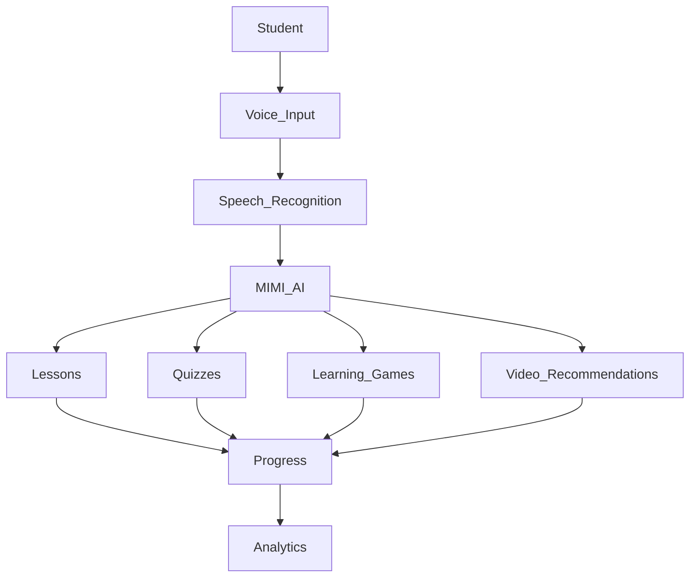

<div align="center">

# MIMI – AI Voice Learning Tutor

### Intelligent AI Learning Companion



<br>

<p>
  
  
  
  
</p>

AI-powered voice learning platform designed to deliver personalized education through natural conversations, intelligent tutoring, quizzes, learning games, educational videos, and real-time progress tracking.

**Portfolio:** https://innovativeais.com/others/portfolio-mimy.php

</div>

---

## Table of Contents

- About
- Features
- Learning Workflow
- Supported Subjects
- Student Dashboard
- Core Modules
- Technology Stack
- Future Enhancements
- License

---

# About

MIMI is an AI-powered voice learning platform developed under the **ALEXI AI** ecosystem.

The platform provides students with an intelligent tutor capable of explaining concepts through natural conversations, answering questions, recommending educational content, generating quizzes, creating personalized study plans, and monitoring learning progress.

MIMI adapts to every learner's pace, making education interactive, personalized, and accessible.

---

# Features

| Module | Description |
|---------|-------------|
| Voice Assistant | Human-like conversations with students |
| Smart Learning | Personalized lessons based on learning level |
| Quiz Generator | AI-generated quizzes after every lesson |
| Learning Games | Interactive educational activities |
| Video Recommendations | Curated educational videos |
| Study Planner | Personalized study schedules |
| Progress Analytics | Performance tracking and reports |
| Multi-language Support | Learning in multiple languages |

---

# Learning Workflow



---

# Supported Subjects

- Mathematics
- Physics
- Chemistry
- Biology
- English
- Computer Science
- Programming
- Artificial Intelligence
- Machine Learning
- Data Science
- History
- Geography
- General Knowledge
- Competitive Examination Preparation

---

# Student Dashboard

```text


Lessons Completed      ████████████   88%

Quiz Accuracy          ███████████    93%

Learning Games         █████████      82%

Learning Streak        24 Days

Study Time             51 Hours

Overall Performance    Excellent


```

---

# Core Modules

- Student Profile Management
- AI Voice Tutor
- Smart Learning Engine
- Quiz Generator
- Learning Games
- Study Planner
- Progress Dashboard
- Educational Video Recommendations
- Notifications
- Learning Analytics


---

# Future Enhancements

- Mobile Application
- Offline Learning
- Parent Dashboard
- Teacher Dashboard
- Live Classes
- AI Homework Assistant
- Gamification
- Voice Cloning
- Regional Language Support
- Advanced Learning Analytics

---

---

# Contact

For questions, collaborations, or business inquiries, feel free to reach out.

| Contact | Details |
|---------|---------|
| Website | https://innovativeais.com |
| Email | info@innovativeais.com |
| LinkedIn | [https://www.linkedin.com/company/innovative-ai-solution-475489323](https://www.linkedin.com/in/innovative-ai-solution-475489323/) |

---

# License

This project is licensed under the **MIT License**. See the `LICENSE` file for more information.

---

<div align="center">

## ALEXI AI

Building the future of education through intelligent, AI-powered voice learning.

MIMI is designed to make learning more interactive, personalized, and accessible through conversational AI, adaptive learning, and modern educational technology.

If you found this project useful, consider giving it a **Star** on GitHub.

Thank you for visiting the repository.

</div>
